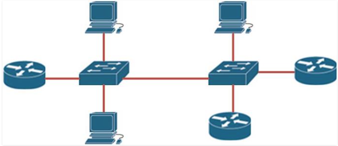

# How **link-state routing protocols** work

- Link-state protocols use the **SPF algorithm** which was developed by **Edsger Dijkstra**

- The routers that share a link will **recognize the neighboring routers** and **form relationships**

- When this relationship has been formed, they will **share their directly connected routes** with each other

- The neighbors that receive this information will then **propagate it to other neighbors**

- When all the neighbors know all the routes, each router will use the information to create a **MAP** to all the destinations in the networks

- When this map has been created, the **SPF (Shortest Path First) algorithm**, is run to determine which the best route to a particular remote network is


# OSPF packets types

## Hello

- They are the **first messages** that are sent by routers that have been configured with OSPF

- They use the **multicast IP address** specially **reserved for OSPF** which is `224.0.0.5`

- Sent at **10-second interval**

- Purpose: **discover neighbors** and **maintain relationships**

## DBD (Database Description)

- This packet is **a list which contains a summary of routes** that have been learnt by a particular router in the routing domain

- The router that receives this packet, checks the list against its own link-state database, to discover any missing routes

## LSR (Link-state request)

- When a router discovers that it is missing some routes as a result of the information contained in a DBD packet it has received

- It sends this packet to the router that informed it of the missing routes, requesting more detailed information on the missing routes

- This is done so that it can update its link-state database with these missing routes

## LSU (Link-State Update)

- This packet is sent by a router that has information on any missing routes

- It contains the next-hop information and the cost to reach the particular route that **was requested using an LSR**

## LSAck (Link-State Acknowledgment)

- This is a packet that is sent to confirm that a router has received an LSU


# Basic OSPF Config

## Enable OSPF: `R1(config)# router ospf <process_id>`

- The process ID is locally signifcicant (between 1 and 65535)

- Neighboring routers do not need this number to match

## Advertise Routes: `R1(config-router)# network <network_address> <wildcard_mask> area <area_ID>`

- If we use one area, we must use the backbone area `0`

- The `network` command advertises the **directly connected networks** that we want to participate in OSPF

## OSPF Router ID: `R1(config-router)# router-id <unique_ip_address>`

- The Router ID is a way to name each router in the routing domain

- If not configured, it selects the highest IP of the **loopback interface** or **active physical interface**

- Example: `R1(config-router)# router-id 1.1.1.1`

- Configure Loopback Interface

    ```bash
    Router(config)# interface loopback 0
    Router(config-if)# ip address 1.1.1.1 255.255.255.255
    Router(config-if)# exit
    Router(config)# router ospf 1
    Router(config-router)# router-id 1.1.1.1
    ```

## Verifying OSPF operation

```bash
show ip ospf
show ip ospf neighbor
show ip ospf interface
show ip ospf database
```


# OSPF Cost

## The cost formula

- `cost = reference bandwidth / interface bandwidth`

- The `reference bandwidth` is 100 Mbps

- Problem: `100 Mbps` Link (100 / 100 = **1**) and a `10 Gbps` Link (100 / 10000 = 0.1 which is **1**) have the same cost (**1**)

## Cumulative Metric

- Path cost is calculated as the sum of all **outbound interface** costs along the path to the destination

## Inspect Interface Cost of a Router

```bash 
R1# show ip ospf interface G0/1
    GigabitEthernet0/1 is up, line protocol is up 
    Internet Address 192.168.10.1/24, Area 0, Attached via Interface Enable
    Process ID 1, Router ID 10.1.1.1, Network Type BROADCAST, Cost: 1
```

## Modify OSPF Cost

- Method 1: Change Reference Bandwidth (Recommended)

    ```bash
    R1(config)# router ospf 1
    R1(config-router)# auto-cost reference-bandwidth 10000
    ```

- Method 2: Set Cost Directly on Interface

    ```bash
    R1(config)# interface gigabitethernet 0/0/0
    R1(config-if)# ip ospf cost 45
    ```

    - Notes: we have to configure the same thing for the port of the neighbor router (the command has to be executed on both ends of the link)

    - Example: R2 has interface G0/0/0 connected to R1 interface G0/0/0, we have to set cost 45 for R2 interface G0/0/0


# Passive Interface

- Prevent routing updates being propagated to **interfaces connected to users** and **loopback interface**

    `R1(config-router)# passive-interface <interface-id>`

- Tip: configuring all interfaces on a router as passive interfaces, then negating this command on each interface where OSPF updates need to be sent

    ```bash
    router ospf 1
    passive-interface default
    no passive-interface GigabitEthernet0/0
    ```


# Redistributing Default Route

`R1(config-router)#default-information originate`

- Only do this on the router connected to the ISP

- No need to do it on the other routers


# OSPF Multi Area

## Router Types

- Internal Router: All of its interfaces reside entirely within a single area

- ABR

    - Area Border Router
    
    - Connects two or more areas (must have at least one interface in Area 0 and one in a non-backbone area)
    
    - Maintains separate Link-State Databases (`LSDB`) for each connected area

- ASBR: Connects the OSPF network to an outside network domain (e.g., BGP, EIGRP, or a static default route to the Internet)

## Route Types (`show ip routes`): `O`, `O IA`, `O*E2`

```bash
Router# show ip route

Gateway of last resort is 10.0.0.1 to network 0.0.0.0

Gateway of last resort is 10.0.0.1 to network 0.0.0.0

      10.0.0.0/8 is variably subnetted, 6 subnets, 2 masks
C        10.1.10.0/24 is directly connected, GigabitEthernet0/0/0
L        10.1.10.1/32 is directly connected, GigabitEthernet0/0/0
O        10.1.20.0/24 [110/11] via 10.1.10.2, 00:14:22, GigabitEthernet0/0/0
O IA     10.2.10.0/24 [110/21] via 10.0.0.2, 01:05:10, GigabitEthernet0/0/1
O*E2  0.0.0.0/0 [110/1] via 10.0.0.1, 02:11:45, GigabitEthernet0/0/1
```

- `O`: **Intra-area** route (Destination network is inside the same area)

- `O IA`: **Inter-area** route (Destination network is in a different area, learned from an ABR)

- `O*E2`: **External** route (Learned outside of OSPF, like a default route to the Internet redistributed into OSPF)

## LSA Section Types in `show ip ospf database`

```bash
R1# show ip ospf database

            OSPF Router with ID (1.1.1.1) (Process ID 1)

		Router Link States (Area 0)

Link ID         ADV Router      Age         Seq#       Checkbox Link count
1.1.1.1         1.1.1.1         342         0x80000003 0x004A2C 2
2.2.2.2         2.2.2.2         1205        0x80000002 0x003D3B 1

		Net Link States (Area 0)

Link ID         ADV Router      Age         Seq#       Checkbox
10.0.0.2        2.2.2.2         1205        0x80000001 0x008F12

		Summary Net Link States (Area 0)

Link ID         ADV Router      Age         Seq#       Checkbox
10.1.20.0       1.1.1.1         342         0x80000001 0x002B41

		Router Link States (Area 1)

Link ID         ADV Router      Age         Seq#       Checkbox Link count
1.1.1.1         1.1.1.1         342         0x80000004 0x005B1E 1
10.1.20.2       10.1.20.2       890         0x80000002 0x001A8F 2

		Summary Net Link States (Area 1)

Link ID         ADV Router      Age         Seq#       Checkbox
10.0.0.0        1.1.1.1         342         0x80000001 0x003A12
10.2.10.0       1.1.1.1         342         0x80000001 0x00412B

		Type-5 AS External Link States

Link ID         ADV Router      Age         Seq#       Checkbox Tag
0.0.0.0         2.2.2.2         1500        0x80000001 0x009E01 0
```

- Router Link States (Type 1 LSA)

    - LSA is created by all routers in the same area

    - LSA isn't sent to other areas

- Net Link States (Type 2 LSA)

- Summary Net Link States (Type 3 LSA - Summary LSA)

    - Sent by **ABR Routers** to other areas

    - Summarize **Type 1, Type 2 and Type 3 LSAs** from areas

    - If one area has 20 IP Networks all in the `/16` network, instead of sending 20 LSAs, the ABR can send one LSA with the single `/16` network

- Type-5 AS External Link States (Type 5 LSA)

    - Redistributed by the **ASBR Router** across the entire OSPF domain

    - Inside that Type 5 LSA, the ASBR puts its Router ID as the **ADV Router** (Advertising Router)

    - Why do we need LSA Type 4?

        - Type 3 LSAs advertise subnets (IP addresses + masks), whereas Type 4 LSAs specifically advertise a Router ID (a node, not a subnet)

        - When a Type 5 LSA moves from Area 1 into Area 0, the ABR leaves the ADV Router field set to the original ASBR's Router ID (e.g., `4.4.4.4`)

        - Inside Area 1, routers know how to physically reach Router ID 4.4.4.4 because of the Type 1 LSAs flooded in Area 1

        - Routers in area 0 and 2 receive the Type 5 LSA saying: "Network 0.0.0.0/0 is available via Advertising Router 4.4.4.4."

        - However, because Type 1 LSAs are blocked by the ABR, routers in Area 0 and Area 2 have no idea where Router 4.4.4.4 lives or how to reach it


# Broadcast Multi Access Network

## What is a multi-access network

- Multi-access networks, are networks that consist of more than 2 devices sharing the same media

- In the example shown below, the three routers and three PCs are interconnected using the two switches at the center of the topology

    

- This means that the interfaces on the routers that connect to the switches as well as the PCs are in the same subnet

## Challenges in OSPF Broadcast multi-access networks

- Multiple adjacencies

    - Neighboring routers in OSPF usually create adjacencies with each other (point-to-point networks)

    - In multi-area network, one router can have multiple adjacencies to other routers

- Flooding of LSAs

## Solutions to OSPF broadcast multi-access problems (`DR` and `BDR`)

- One router is elected as DR, one router is elected as BDR

- If a network of a router is down, the router will inform only the DR Router

- If the DR Router is down, the BDR will be informed instead

## Election of DR and BDR

- First: elect the router with the highest OSPF priority as the DR

- Second: Elect the router with the second highest OSPF priority as the BDR

- Third: If the priorities are equal, the DR is elected based on the highest router ID

