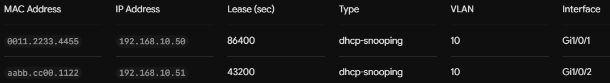

# Table of contents

- [Table of contents](#table-of-contents)
- [Port Security](#port-security)
  - [What it is](#what-it-is)
  - [MAC Address Learning Methods](#mac-address-learning-methods)
  - [Violation Modes](#violation-modes)
  - [Configuration Walkthrough (Cisco IOS)](#configuration-walkthrough-cisco-ios)
- [DHCP Snooping](#dhcp-snooping)
  - [What it is](#what-it-is-1)
  - [Core Principles: Trusted vs. Untrusted Ports](#core-principles-trusted-vs-untrusted-ports)
  - [The DHCP Snooping Binding Database](#the-dhcp-snooping-binding-database)
  - [Rogue DHCP Servers \& DHCP Starvation Attacks](#rogue-dhcp-servers--dhcp-starvation-attacks)
  - [Configuration Walkthrough (Cisco IOS)](#configuration-walkthrough-cisco-ios-1)
- [Dynamic ARP Inspection](#dynamic-arp-inspection)
  - [What it is](#what-it-is-2)
  - [How Dynamic ARP Inspection Works](#how-dynamic-arp-inspection-works)
  - [Configuration Walkthrough (Cisco IOS)](#configuration-walkthrough-cisco-ios-2)


# Port Security

## What it is

- A Layer 2 traffic-filtering feature on network switches

- It limits the MAC addresses of hosts allowed to access the port

## MAC Address Learning Methods

- Static: Manually configured MAC address(es) saved in the running configuration

- Dynamic: Discovered dynamically and stored in the MAC address table until reboot or aging timeout

- Sticky: Dynamically learned, but automatically added to the running-config. This persists across reboots if you save the configuration (`write memory`)

## Violation Modes

- Shutdown (Default)

    - Places the interface into the `err-disabled` state, shutting down all traffic immediately
    
    - Generates syslog messages and increments the violation counter

- Restrict

    - Drops packets from unknown MAC addresses, increments the violation counter, and generates a syslog/SNMP trap
    
    - Keeping the port active for authorized devices

- Protect: Silently drops unauthorized packets. It does not log messages or increment the violation counter

## Configuration Walkthrough (Cisco IOS)

```bash
# enable port security
Switch(config-if)# switchport port-security

# set maximum allowed MAC addresses
Switch(config-if)# switchport port-security maximum 2

# define MAC learning method
Switch(config-if)# switchport port-security mac-address sticky

# config the violation mode
Switch(config-if)# switchport port-security violation restrict

# verification
Switch# show port-security interface GigabitEthernet1/0/1
Switch# show port-security address

# manually recover an err-disabled port
Switch(config-if)# shutdown
Switch(config-if)# no shutdown
# automatic recovery after a timeout period (e.g., 300 seconds)
Switch(config)# errdisable recovery cause psecure-violation
Switch(config)# errdisable recovery interval 300
```


# DHCP Snooping

## What it is

- A L2 security feature built into network switches that acts like a firewall between untrusted hosts and legitimate DHCP servers

- It inspects DHCP traffic passing through the switch to block rogue DHCP servers, prevent DHCP starvation attacks

- It build a IP-to-MAC mapping database used by other security features

## Core Principles: Trusted vs. Untrusted Ports

- When you enable DHCP Snooping, the switch classifies all switch ports into two categories

- Trusted Ports

    - Ports connected to legitimate DHCP servers, upstream switches, or routers

    - Behavior: Traffic flows freely. All DHCP messages (including DHCP OFFER and DHCP ACK) are allowed to pass through

- Untrusted Ports (Default state for all ports)

    - Ports connected to end-user devices (PCs, laptops, access points, wall jacks)

    - Allowed to send DHCP Requests (DISCOVER, REQUEST)
        
    - If a server response (OFFER, ACK, NACK) is received on an untrusted port, the switch drops the packet immediately and logs a security violation

## The DHCP Snooping Binding Database

- As clients request and receive IP addresses across untrusted ports, the switch passively eavesdrops ("snoops") on the traffic and builds a DHCP Binding Table

    

- This binding database is critical because other Layer 2 security tools rely on it to function

    - Dynamic ARP Inspection (`DAI`): Uses the table to stop ARP poisoning/spoofing attacks

    - IP Source Guard (`IPSG`): Uses the table to block hosts from using unauthorized static IP addresses

## Rogue DHCP Servers & DHCP Starvation Attacks

- Rogue DHCP Servers: Stops unauthorized routers or attacker PCs from handing out malicious IP configurations (bad gateway or rogue DNS server IPs) to intercept traffic

- DHCP Starvation Attacks: Prevents tools like Gobbler from spamming fake MAC addresses to exhaust the legitimate DHCP server pool. (Enforced via rate-limiting and MAC matching)

## Configuration Walkthrough (Cisco IOS)

```bash
# turn on the DHCP snooping process across the switch
Switch# configure terminal
Switch(config)# ip dhcp snooping

# enable snooping on specific VLANs
Switch(config)# ip dhcp snooping vlan 10,20

# configure trusted port
Switch(config)# interface GigabitEthernet1/0/24
Switch(config-if)# ip dhcp snooping trust

# set rate limits on untrusted ports
Switch(config)# interface range GigabitEthernet1/0/1 - 23
Switch(config-if-range)# ip dhcp snooping limit rate 15

# verification
Switch# show ip dhcp snooping
Switch# show ip dhcp snooping binding
```


# Dynamic ARP Inspection

## What it is

- Dynamic ARP Inspection (DAI) is a Layer 2 security feature on network switches that validates Address Resolution Protocol (ARP) packets in a network

- It intercepts, logs, and discards ARP packets with invalid IP-to-MAC address bindings to prevent **ARP spoofing and ARP poisoning** attacks

    - ARP Spoofing and ARP Poisoning are the same

    - Attackers send fake ARP responses to a victim host and the default gateway, informing both that the attacker's MAC address is associated with the other party's IP

## How Dynamic ARP Inspection Works

- DAI relies on **a database of valid IP-to-MAC address pairs** to verify incoming ARP requests and replies received on untrusted interfaces

- Trusted Ports

    - Interfaces connected to other switches, routers, or gateways

    - Behavior: DAI bypasses inspection on trusted ports. All ARP traffic flows freely

- Untrusted Ports (Default for all access ports)

    - Interfaces connected to end-user devices or host machines

    - The switch intercepts every ARP request and reply coming into the port and verifies the IP-to-MAC mapping inside the payload against its database

    - If the binding matches, the ARP packet is forwarded. If the binding does not match, the switch drops the ARP packet and logs a security violation

- DAI checks incoming ARP packets against **two primary sources**

    - DHCP Snooping Binding Database

    - ARP Access Control Lists (ARP ACLs)
    
        - For devices with static IP addresses (servers, printers, static management IPs), engineers manually configure static ARP ACLs mapping specific MACs to IPs

## Configuration Walkthrough (Cisco IOS)

```bash
# globally activate Dynamic ARP Inspection for your user VLANs
Switch# configure terminal
Switch(config)# ip arp inspection vlan 10,20

# config trusted interfaces
Switch(config)# interface GigabitEthernet1/0/24
Switch(config-if)# ip arp inspection trust

# config static ARP ACL for non-DHCP hosts
Switch(config)# arp access-list STATIC_DEVICES
Switch(config-arp-acl)# permit ip host 192.168.10.10 mac host 0011.2233.4455
Switch(config)# ip arp inspection filter STATIC_DEVICES vlan 10

# set ARP rate limits on access ports
Switch(config)# interface range GigabitEthernet1/0/1 - 23
Switch(config-if-range)# ip arp inspection limit rate 15

# verification
Switch# show ip arp inspection vlan 10
Switch# show ip arp inspection interfaces
```